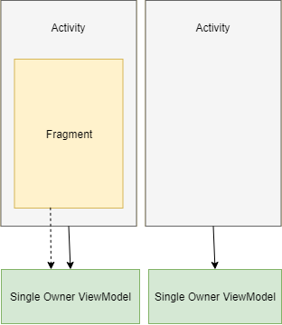
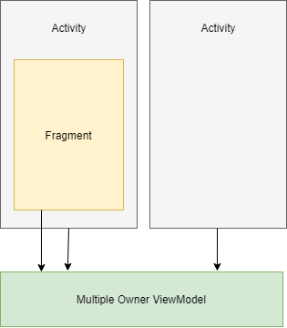
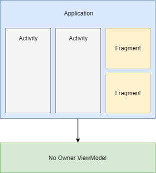

# Vita
An extension for android ViewModel

 

  

As we know we need a LifeCycleOwner (e.g Fragment or FragmentActivity) to create ViewModels, when the owner is at the end of its lifecycle the ViewModel will be cleared as well, Sometimes you need to share the ViewModel between multiple owners, By default we can only share ViewModel of an activity between its fragments for now, nothing more...

**Vita** is a light and simple library that helps you to share ViewModel between fragments and activities, even you can create ViewModels in application scope

## What Vita does:
- Creates ViewModels with **Single Owner**:
 This is the default ViewModel behavior that already have, The ViewModels created in this way are only available to the owner.
 
  
 

  

- Creates ViewModels with **Multiple Owners**:
 The ViewModels are shared between multiple owners and stay alive while at least one owner is alive
 
  
 

  

- Creates ViewModels with **No Owner**:
 The ViewModels has no owner, they are available in the application scope and stay alive until the user closes the application
 
  
 

  

